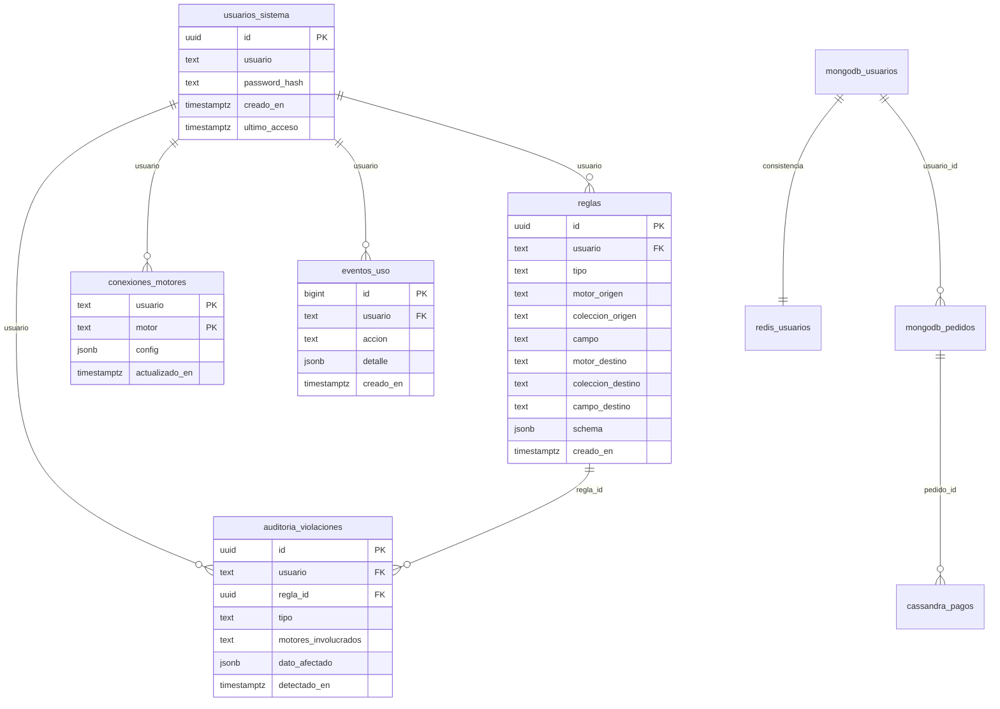
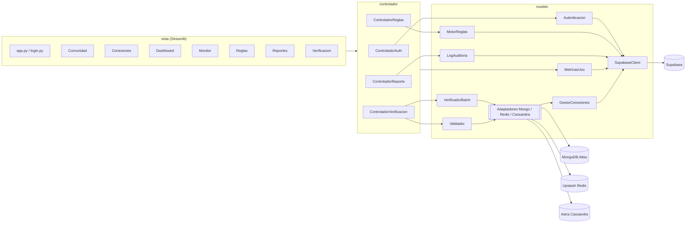
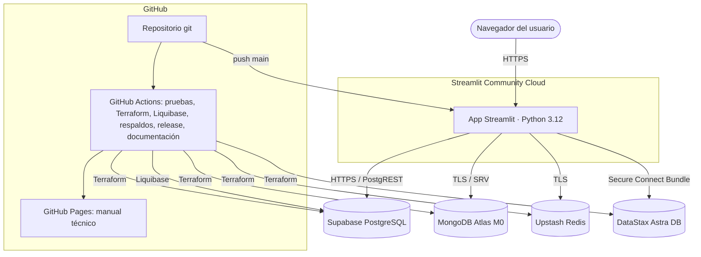

# Motor de Integridad Multibase NoSQL

Plataforma web que define y aplica reglas de integridad (esquema, unicidad, integridad referencial y
consistencia) sobre bases de datos NoSQL heterogéneas: **MongoDB Atlas**, **Redis (Upstash)** y
**Cassandra (DataStax Astra)**, con Supabase como base de control.

| | |
|---|---|
| Aplicación desplegada | <https://motor-integridad.streamlit.app/> |
| Manual técnico, diagramas y API | <https://keylalopezz.github.io/motor-integridad/> |
| Repositorio de despliegue | <https://github.com/keylalopezz/motor-integridad> |
| Curso | SI783 Base de Datos II · Universidad Privada de Tacna |
| Docente | Ing. Patrick José Cuadros Quiroga |
| Integrantes | Keyla Noelia Lopez Ojeda (2023078690) · Adrian Fabricio Salas Acuña (2021069829) |

## Automatizaciones (GitHub Actions)

| Flujo | Qué hace | Reporte |
|---|---|---|
| `documentacion.yml` | Pruebas, diagramas UML (PlantUML, pyreverse), API (pdoc) y manual (MkDocs) en GitHub Pages | Artefacto `documentacion-tecnica` |
| `readme.yml` | Regenera la sección de documentación de este README | Commit automático |
| `infraestructura.yml` | Terraform: formato, validación, pruebas con proveedores simulados y costos; `plan`/`apply` manual | `reporte-infraestructura` |
| `liquibase.yml` | Crea/actualiza los objetos de la base de datos con Liquibase | `reporte-liquibase` |
| `respaldo.yml` | Copia de seguridad semanal cifrada de Supabase, MongoDB, Redis y Cassandra | `respaldo-N` (30 días) |
| `release.yml` | Con una etiqueta `vX.Y.Z`: pruebas, Release con el paquete, migración y despliegue verificado | Release de GitHub |

Secretos usados (Settings → Secrets and variables → Actions): `SUPABASE_URL`, `SUPABASE_KEY`,
`ENCRYPTION_KEY` (respaldos), `LIQUIBASE_URL`, `LIQUIBASE_USERNAME`, `LIQUIBASE_PASSWORD` (migraciones) y,
solo para aprovisionar con Terraform, las claves de Supabase, Atlas, Upstash y Astra (ver `infra/`).

Instalación y uso de la aplicación: [README_APP.md](README_APP.md).

<!-- AUTO-DOC:INICIO -->
## Documentación generada automáticamente

> Sección generada por `scripts/generar_readme.py` (GitHub Actions). No editar a mano.

### Diccionario de datos

**Base de control (Supabase / PostgreSQL)**

#### `usuarios_sistema`

Cuentas de acceso a la plataforma

| Columna | Tipo | Llave | Restricciones | Descripción |
|---|---|---|---|---|
| `id` | uuid | PK | default gen_random_uuid() | Identificador único |
| `usuario` | text |  | unique not null | Nombre del usuario propietario |
| `password_hash` | text |  | not null | Contraseña cifrada con bcrypt |
| `creado_en` | timestamptz |  | default now() | Fecha y hora de creación |
| `ultimo_acceso` | timestamptz |  | default now() | Última actividad del usuario |

#### `reglas`

Reglas de integridad definidas por cada usuario

| Columna | Tipo | Llave | Restricciones | Descripción |
|---|---|---|---|---|
| `id` | uuid | PK | default gen_random_uuid() | Identificador único |
| `usuario` | text | FK → usuarios_sistema.usuario | on delete cascade | Nombre del usuario propietario |
| `tipo` | text |  | not null check (tipo in ('esquema','unicidad','referencial','consistencia')) | Tipo de regla: esquema, unicidad, referencial o consistencia |
| `motor_origen` | text |  | not null | Motor donde se evalúa la regla |
| `coleccion_origen` | text |  | not null | Colección, prefijo o tabla evaluada |
| `campo` | text |  | not null | Campo evaluado o de cruce |
| `motor_destino` | text |  |  | Motor de referencia (reglas entre motores) |
| `coleccion_destino` | text |  |  | Colección de referencia |
| `campo_destino` | text |  |  | Campo de referencia |
| `schema` | jsonb |  |  | JSON Schema de la regla de esquema |
| `creado_en` | timestamptz |  | default now() | Fecha y hora de creación |

#### `auditoria_violaciones`

Anomalías detectadas por la validación y el escaneo batch

| Columna | Tipo | Llave | Restricciones | Descripción |
|---|---|---|---|---|
| `id` | uuid | PK | default gen_random_uuid() | Identificador único |
| `usuario` | text | FK → usuarios_sistema.usuario | on delete cascade | Nombre del usuario propietario |
| `regla_id` | uuid | FK → reglas.id | on delete cascade | Regla incumplida |
| `tipo` | text |  | not null | Tipo de regla: esquema, unicidad, referencial o consistencia |
| `motores_involucrados` | text |  | not null | Motores donde se detectó la anomalía |
| `dato_afectado` | jsonb |  |  | Registro que incumple la regla |
| `detectado_en` | timestamptz |  | default now() | Fecha y hora de detección |

#### `conexiones_motores`

Credenciales cifradas de cada motor NoSQL por usuario

| Columna | Tipo | Llave | Restricciones | Descripción |
|---|---|---|---|---|
| `usuario` | text | PK | on delete cascade | Nombre del usuario propietario |
| `motor` | text | PK | not null | mongodb, redis o cassandra |
| `config` | jsonb |  | not null | Credenciales cifradas con Fernet |
| `actualizado_en` | timestamptz |  | default now() | Fecha de la última actualización |

#### `eventos_uso`

Eventos de utilización del producto (dashboard de uso)

| Columna | Tipo | Llave | Restricciones | Descripción |
|---|---|---|---|---|
| `id` | bigint | PK | generated always as identity | Identificador único |
| `usuario` | text | FK → usuarios_sistema.usuario | on delete cascade | Nombre del usuario propietario |
| `accion` | text |  | not null | login, registro, conexion, regla, validacion o escaneo |
| `detalle` | jsonb |  | default '{}'::jsonb | Datos adicionales del evento |
| `creado_en` | timestamptz |  | default now() | Fecha y hora de creación |

**Motores NoSQL validados (caso de estudio)**

| Motor | Colección / clave | Campos | Descripción |
|---|---|---|---|
| MongoDB Atlas | `tienda.usuarios` | _id, nombre, email, edad | Clientes de la tienda (caso de estudio) |
| MongoDB Atlas | `tienda.pedidos` | _id, usuario_id, total, estado | Pedidos; usuario_id → usuarios._id |
| Upstash Redis | `usuarios:&lt;id&gt; / pedidos:&lt;id&gt;` | JSON o hash con los mismos campos | Réplica en caché de usuarios y pedidos |
| DataStax Astra | `tienda.pagos` | id, pedido_id, monto, transaccion | Pagos; pedido_id → pedidos._id |

### Diagrama entidad-relación

### Diagrama de clases

```mermaid
classDiagram
    class ControladorAuth {
        -auth
        +registrar(usuario, password)
        +login(usuario, password)
        +actualizar_actividad(usuario)
        +obtener_usuarios_activos(minutos)
    }
    class ControladorReglas {
        -metricas
        -motor
        +crear_regla(regla)
        +obtener_reglas(filtros)
        +eliminar_regla(regla_id)
    }
    class ControladorReporte {
        -auditoria
        +obtener_violaciones(filtros)
    }
    class ControladorVerificacion {
        -metricas
        -validador
        -verificador
        +validar_insercion(motor, coleccion, registro)
        +ejecutar_verificacion_batch()
    }
    class Adaptador {
        +existe(coleccion, campo, valor)
        +obtener(coleccion, filtro)
        +contar_duplicados(coleccion, campo, valor)
        +obtener_todos(coleccion)
        +verificar_salud()
        +listar_recursos()
        +obtener_muestra(coleccion, limite)
        +obtener_info_completa()
        +cerrar()
    }
    class CassandraAdapter {
        -_temp_bundle_path
        -cluster
        -keyspace
        -session
        +verificar_salud()
        +obtener_info_completa()
        +listar_recursos()
        +obtener_muestra(coleccion, limite)
        +existe(coleccion, campo, valor)
        +obtener(coleccion, filtro)
        +contar_duplicados(coleccion, campo, valor)
        +obtener_todos(coleccion)
        +cerrar()
    }
    class MongoAdapter {
        -client
        -db
        +verificar_salud()
        +obtener_info_completa()
        +listar_recursos()
        +obtener_muestra(coleccion, limite)
        +existe(coleccion, campo, valor)
        +obtener(coleccion, filtro)
        +contar_duplicados(coleccion, campo, valor)
        +obtener_todos(coleccion)
        +cerrar()
    }
    class RedisAdapter {
        -client
        -host
        +verificar_salud()
        +obtener_info_completa()
        +listar_recursos()
        +obtener_muestra(coleccion, limite)
        +existe(coleccion, campo, valor)
        +obtener(coleccion, filtro)
        +contar_duplicados(coleccion, campo, valor)
        +obtener_todos(coleccion)
        +cerrar()
    }
    class Autenticacion {
        -supabase
        +registrar_usuario(usuario, password)
        +verificar_login(usuario, password)
        +actualizar_actividad(usuario)
        +obtener_usuarios_activos(minutos)
    }
    class GestorConexiones {
        -supabase
        -usuario
        +guardar_conexion(motor, config)
        +obtener_conexion(motor)
        +motores_configurados()
        +eliminar_conexion(motor)
    }
    class LogAuditoria {
        -supabase
        -usuario
        +registrar_violacion(violacion)
        +registrar_violaciones(violaciones)
        +limpiar_regla(regla_id)
        +obtener_violaciones(filtros)
    }
    class MetricasUso {
        -supabase
        -usuario
        +registrar(accion, detalle)
        +obtener_eventos(dias, todos)
    }
    class MotorReglas {
        -supabase
        -usuario
        +crear_regla(regla)
        +obtener_reglas(filtros)
        +actualizar_regla(regla_id, datos)
        +eliminar_regla(regla_id)
    }
    class SupabaseClient {
        +get_client()
    }
    class Validador {
        -motor_reglas
        -usuario
        +validar_registro(motor, coleccion, registro)
    }
    class VerificadorBatch {
        -_adaptadores
        -auditoria
        -errores
        -motor_reglas
        -usuario
        +ejecutar_verificacion()
    }
    ABC <|-- Adaptador
    Adaptador <|-- CassandraAdapter
    Adaptador <|-- MongoAdapter
    Adaptador <|-- RedisAdapter
    Autenticacion --> SupabaseClient
    CassandraAdapter --> Cluster
    CassandraAdapter --> PlainTextAuthProvider
    ControladorAuth --> Autenticacion
    ControladorReglas --> MetricasUso
    ControladorReglas --> MotorReglas
    ControladorReporte --> LogAuditoria
    ControladorVerificacion --> MetricasUso
    ControladorVerificacion --> Validador
    ControladorVerificacion --> VerificadorBatch
    GestorConexiones --> SupabaseClient
    LogAuditoria --> SupabaseClient
    MetricasUso --> SupabaseClient
    MongoAdapter --> MongoClient
    MotorReglas --> SupabaseClient
    Validador --> MotorReglas
    VerificadorBatch --> LogAuditoria
    VerificadorBatch --> MotorReglas
```

### Diagrama de componentes

### Diagrama de despliegue

<!-- AUTO-DOC:FIN -->
